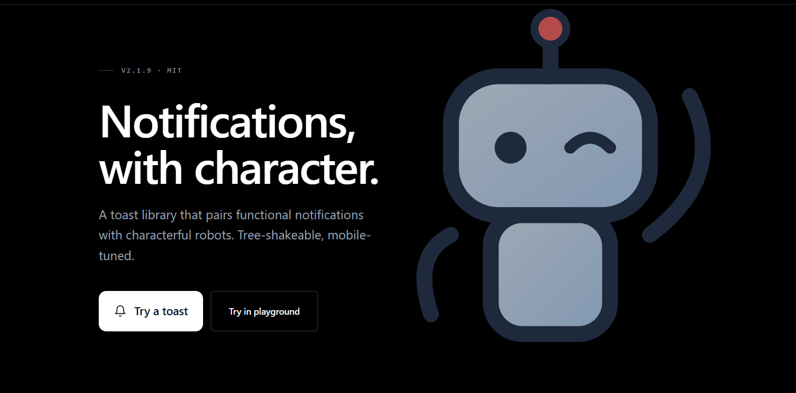
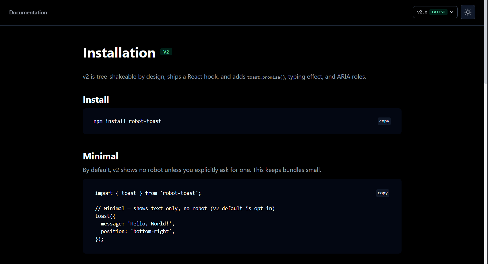
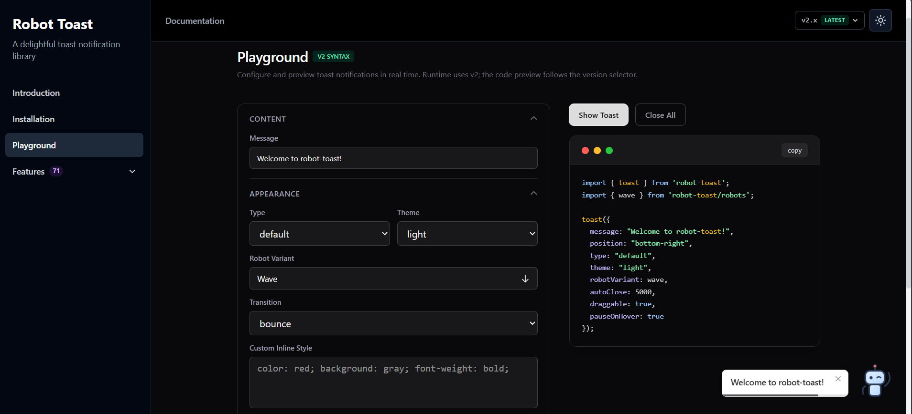
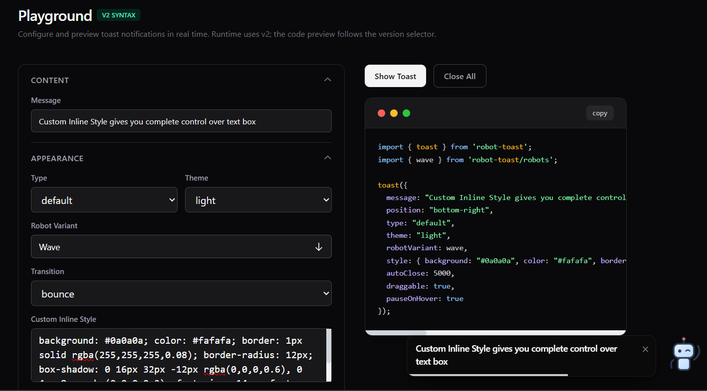
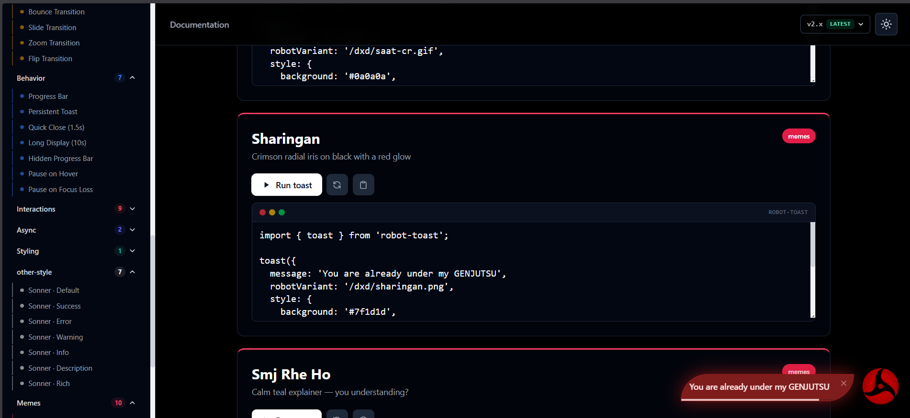
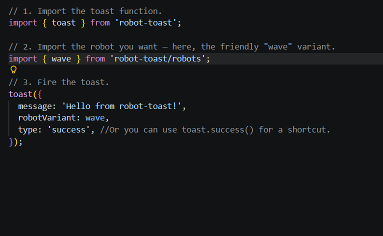

# robot-toast

The official documentation and interactive playground site for [**robot-toast**](https://www.npmjs.com/package/robot-toast), a framework-agnostic toast notification library with an animated robot character, tree-shakeable robots, `toast.promise()`, and an optional React hook.

<p align="center">
  
</p>

<p align="center">
  <a href="https://robot-toast.vercel.app">Live site</a>
  ·
  <a href="https://robot-toast.vercel.app/playground">Playground</a>
  ·
  <a href="https://www.npmjs.com/package/robot-toast">npm package</a>
</p>

---

## What is this?

This repo is the **website** for robot-toast, not the library itself. It's a Next.js app that hosts:

- a **landing page** introducing the library,
- an **installation guide** with a v1 / v2 version toggle,
- an **interactive playground** to configure and preview toasts live,
- a **features showcase** demoing every option.

Looking for the library source? That lives in the [robot-toast package repo](https://github.com/Pratham2703005/robot-toast-package).

## Tech stack

| | |
|---|---|
| Framework | Next.js 16 (App Router) |
| UI | React 19 |
| Styling | Tailwind CSS 4 |
| Theming | `next-themes` (light / dark) |
| Icons | `lucide-react` |
| Demoed library | `robot-toast` v2 |

## Getting started

```bash
# 1. Install dependencies
npm install

# 2. Run the dev server
npm run dev
```

Open [http://localhost:3000](http://localhost:3000) to view the site.

```bash
npm run build   # production build
npm run start   # serve the production build
npm run lint    # lint with ESLint
```

## Pages

### Installation

A human-readable install + quickstart guide. The header version toggle switches the entire page between the **v1** and **v2** API.

<p align="center">
  
</p>

### Playground

Configure every toast option — message, position, theme, robot variant, transitions, buttons, custom styles — and preview the result in real time. The code panel updates as you tweak settings and follows the v1 / v2 selector.

<p align="center">
  
</p>

<p align="center">
  
</p>

### Features

A live, scrollable showcase grouping every robot-toast option by category, each with an editable, runnable example.

<p align="center">
  
</p>

## Using robot-toast

The site demos this package — and using it is genuinely this short:

```js
// quick-start.js
import { toast } from 'robot-toast';
import { wave } from 'robot-toast/robots';

toast({
  message: 'Hello from robot-toast!',
  robotVariant: wave,
});
```

<p align="center">
  
</p>

> Robots are **tree-shakeable** — only the variants you import (`wave`, `success`, `error`, …) end up in your bundle. See [`examples/quick-start.js`](examples/quick-start.js).

## Project structure

```
robot-toast-client/
├── app/
│   ├── page.tsx              # Landing page
│   ├── installation/         # Install guide (v1 / v2)
│   ├── playground/           # Interactive playground
│   ├── features/             # Features showcase
│   ├── components/           # Shared UI components
│   └── assets/               # Inline robot data URLs
├── hooks/
│   └── usePlayground.tsx     # Playground state + toast triggering
├── lib/
│   └── robotVariant.ts       # v1 → v2 variant resolution
├── examples/
│   └── quick-start.js        # Minimal usage example
├── constants.ts              # Feature definitions
└── utils.ts                  # Code generation helpers
```

## Contributing

Contributions are welcome — see [CONTRIBUTING.md](CONTRIBUTING.md) for the step-by-step workflow.

## License

MIT
